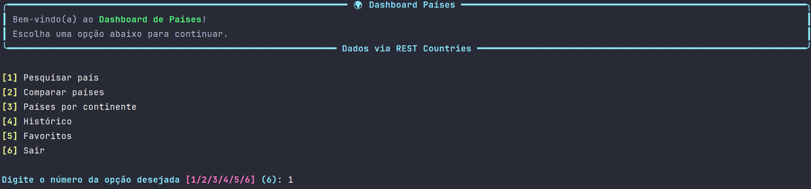
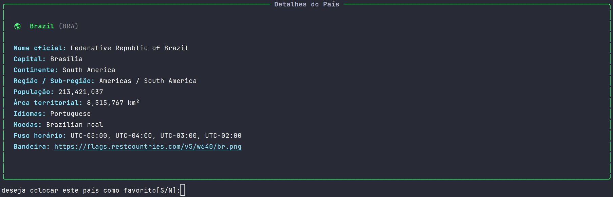

# Dashboard Países

Projeto de estudos em Python que consome a [REST Countries API](https://restcountries.com/) para pesquisar informações sobre países e exibi-las de forma bonita e organizada no terminal, utilizando a biblioteca [Rich](https://github.com/Textualize/rich).

Além da pesquisa simples, o projeto conta com comparação de países lado a lado, histórico de pesquisas e lista de favoritos — tudo persistido em arquivos JSON.

---

## Funcionalidades

- **Pesquisa de países** — busca por nome e exibe dados como capital, região, população, idiomas, moedas, bandeira, entre outros.
- **Comparação de países** — permite selecionar dois (ou mais) países e visualizar seus dados lado a lado em uma tabela.
- **Histórico de pesquisas** — toda pesquisa realizada é salva automaticamente em um arquivo JSON e pode ser consultada depois.
- **Favoritos** — permite marcar países como favoritos, salvos em JSON, com opção de listá-los a qualquer momento.
- **Interface no terminal com Rich** — tabelas, cores e painéis para deixar a visualização mais agradável.

---

## Tecnologias utilizadas

- **Python 3**
- [Rich](https://github.com/Textualize/rich) — formatação e exibição no terminal
- [Requests](https://docs.python-requests.org/) — requisições HTTP
- [REST Countries API](https://restcountries.com/) — fonte dos dados dos países
- **JSON** — armazenamento local de histórico e favoritos

---

## Instalação

1. Clone o repositório:
```bash
git clone https://github.com/MoisesMayyer/dashboard-paises.git
cd dashboard-paises
```

2. Crie um ambiente virtual (opcional, mas recomendado):
```bash
python -m venv venv
source venv/bin/activate   # Linux/Mac
venv\Scripts\activate      # Windows
```

3. Instale as dependências:
```bash
pip install -r requirements.txt
```

### requirements.txt
```
rich
requests
```

---

## Como usar

Execute o programa principal:
```bash
python main.py
```

Um menu interativo será exibido no terminal com as seguintes opções:


<p align="center">
  
</p>


<p align="center">
  
</p>

### 1. Pesquisar país
Digite o nome do país desejado. O sistema busca na REST Countries API e exibe os dados em uma tabela formatada com o Rich, salvando automaticamente a pesquisa no histórico.

### 2. Comparar países
Informe dois ou mais nomes de países. O programa monta uma tabela colocando os dados lado a lado para facilitar a comparação (população, área, capital, região, idiomas, etc).

### 3. Ver histórico
Lista todas as pesquisas já realizadas, carregadas do arquivo `historico.json`.

### 4. Ver favoritos
Lista os países marcados como favoritos, carregados do arquivo `favoritos.json`. É possível adicionar um país aos favoritos a partir da tela de pesquisa.

---

## Estrutura do projeto

```
dashboard_paises/
├── api/
│   ├── __init__.py
│   └── cliente.py         # Funções de consumo da REST Countries API
├── dados/
│   ├── __init__.py
│   ├── favoritos.py       # Funções de leitura/escrita dos favoritos
│   ├── favoritos.json     # Armazena os países favoritados
│   ├── historico.py       # Funções de leitura/escrita do histórico
│   └── historico.json     # Armazena o histórico de pesquisas
├── interface/
│   ├── __init__.py
│   ├── menu.py            # Menu principal / navegação do programa
│   ├── paineis.py         # Painéis de exibição com Rich
│   └── tabelas.py         # Tabelas de exibição com Rich
├── servicos/
│   ├── __init__.py
│   ├── formatador.py      # Formatação dos dados exibidos
│   └── pais.py            # Regras de negócio relacionadas aos países
├── utils/
│   ├── __init__.py
│   ├── erros.py           # Tratamento de erros
│   └── validacoes.py      # Validações de entrada
├── main.py                # Ponto de entrada do programa
├── requirements.txt
└── README.md
```

---

## Armazenamento de dados

O projeto não usa banco de dados — todo o armazenamento é feito em arquivos **JSON** simples, ideal para fins de estudo:

**historico.json**
```json
[
    {
        "data": "31/07/2026",
        "nome": "Brazil",
        "acao": "Pesquisa simples"
    }
]
```

**favoritos.json**
```json
[
    {
        "nome": "Brazil",
        "capital": "Brasília",
        "continente": "South America",
        "populacao": 213421037
    }
]
```

---

## Sobre a API utilizada

O projeto consome a [REST Countries API](https://restcountries.com/), uma API pública e gratuita que fornece informações detalhadas sobre países, como:

- Nome oficial e comum
- Capital
- Região e sub-região
- População
- Área
- Idiomas
- Moedas
- Bandeiras
- Fusos horários

Endpoint principal utilizado para pesquisa por nome:
```
GET https://restcountries.com/v3.1/name/{nome}
```

---

## Objetivo do projeto

Este é um projeto de estudos criado com o objetivo de praticar:

- Consumo de APIs REST em Python
- Manipulação e persistência de dados em JSON
- Criação de interfaces de terminal ricas com a biblioteca Rich
- Organização de código em módulos

---

## Melhorias futuras

- [ ] Permitir remover países dos favoritos
- [ ] Adicionar filtros de pesquisa (por região, moeda, idioma)
- [ ] Exportar histórico/favoritos para outros formatos (CSV, PDF)
- [ ] Testes automatizados

---

## Licença

Este projeto é de uso livre para fins de estudo.